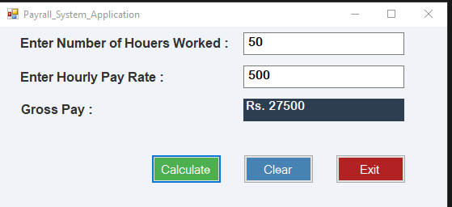

# Payroll System Application
# Gross Pay Calculator 

A simple Windows Forms application developed in C# using Visual Studio to calculate employee gross pay based on hours worked and hourly rate.

## 🧮 Features

- Input for hours worked
- Input for hourly pay rate
- Displays gross pay
- Buttons for:
  - Calculate (green)
  - Clear (blue)
  - Exit (red)

## 📸 Screenshot



## 📐 Calculation Formula

```txt
Gross Pay = Hours Worked × Hourly Rate
